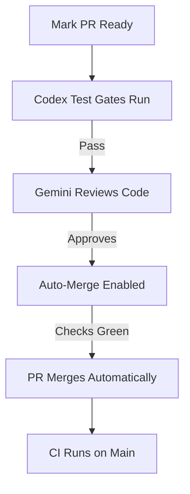

# 🤖 Activate LUASCRIPT Autonomous Automation

## Current State
- ✅ 3 GitHub Actions workflows configured
- ✅ Gemini PR review agent ready
- ✅ Auto-merge on green configured
- ❌ **28 draft PRs blocking automation**

## Quick Start (2 commands)

### 1️⃣ Mark All PRs Ready for Review
```powershell
# This triggers the automation pipeline
gh pr list --state open --draft --json number --jq '.[].number' | ForEach-Object {
    gh pr ready $_ --repo ssdajoker/LUASCRIPT
}
```

### 2️⃣ Add the Magic Label
```powershell
# This triggers Gemini review
gh pr list --state open --json number --jq '.[].number' | ForEach-Object {
    gh pr edit $_ --add-label "ready-for-review" --repo ssdajoker/LUASCRIPT
}
```

## What Happens Next (Autonomous)



## Single-PR Test
```powershell
# Try on PR #134 first
gh pr ready 134 --repo ssdajoker/LUASCRIPT
gh pr edit 134 --add-label "ready-for-review" --repo ssdajoker/LUASCRIPT

# Watch the magic happen:
gh pr view 134 --repo ssdajoker/LUASCRIPT --comments
gh run watch --repo ssdajoker/LUASCRIPT
```

## Advanced: Local Development Sync

### Option A: Git Worktrees (Recommended)
```powershell
# Work on multiple PRs simultaneously without switching branches
git worktree add ../luascript-pr134 codex/fix-134
git worktree add ../luascript-pr135 codex/fix-135

# Each worktree is independent - no file conflicts!
cd ../luascript-pr134
code .  # Opens in new VS Code window
```

### Option B: Smart Branch Switching
```powershell
# Stash current work
git stash push -m "WIP: current changes"

# Switch branches instantly
git checkout codex/fix-135

# Restore later
git stash list
git stash pop stash@{0}
```

### Option C: GitHub CLI Direct Edit
```powershell
# Edit PR without checking out branch
gh pr view 134 --json files --jq '.files[].path' | ForEach-Object {
    gh api repos/ssdajoker/LUASCRIPT/contents/$_ --jq '.content' | 
        base64 -d > temp_$_
}
```

## File Sync Without Manual Copying

### Problem You're Facing
You're manually copying files between branches. **Don't do that!**

### Solution: Use Git Properly
```powershell
# Apply changes from one branch to another
git checkout codex/fix-134
# Make changes...
git add src/core_transpiler.js
git commit -m "feat: add feature X"

# Apply to another branch
git checkout codex/fix-135
git cherry-pick codex/fix-134~1  # Pick last commit from 134
```

### Or: Merge Changes Forward
```powershell
# Keep branches in sync
git checkout codex/fix-135
git merge codex/fix-134 --no-ff -m "merge: pull changes from fix-134"
```

## Environment Variables for Full Automation

Add to your PowerShell profile (`$PROFILE`):
```powershell
# Auto-refresh PR status every 5 minutes
function Watch-LUASCRIPT-PRs {
    while ($true) {
        Clear-Host
        Write-Host "🤖 LUASCRIPT PR Dashboard - $(Get-Date)" -ForegroundColor Cyan
        gh pr list --repo ssdajoker/LUASCRIPT --json number,title,state,statusCheckRollup |
            ConvertFrom-Json | Format-Table -AutoSize
        Start-Sleep 300
    }
}

# Quick commands
function ls-pr { gh pr list --repo ssdajoker/LUASCRIPT $args }
function view-pr { gh pr view $args[0] --repo ssdajoker/LUASCRIPT }
function ready-pr { gh pr ready $args[0] --repo ssdajoker/LUASCRIPT }
```

## Why Automation Wasn't Running

1. **Draft PRs don't trigger workflows** (by design - prevents spam)
2. **Labels must be explicitly added** (`ready-for-review`)
3. **You need to push commits** (workflows run on push events)

## Current Branch Status
```powershell
# Check what's blocking automation right now
gh pr view --repo ssdajoker/LUASCRIPT --json isDraft,labels,statusCheckRollup

# Expected output:
# - isDraft: true  ← THIS IS THE BLOCKER
# - labels: []     ← NEEDS "ready-for-review"
# - statusCheckRollup: {} ← No checks ran yet
```

## The "Google Colab" Confusion Clarified

**What you thought:** Google Colab Extension would sync files automatically  
**What it actually does:** Provides Jupyter notebook support in VS Code  
**What you actually need:** Git worktrees + GitHub Actions (which you have!)

## Next Steps (in order)

1. ✅ **Commit current changes** on `codex/fix-134`
   ```powershell
   git add -A
   git commit -m "feat: implement ArrayExpression, FunctionExpression, SwitchStatement emission"
   git push origin codex/fix-134
   ```

2. ✅ **Mark PR ready**
   ```powershell
   gh pr ready 134 --repo ssdajoker/LUASCRIPT
   ```

3. ✅ **Watch automation run**
   ```powershell
   gh run watch --repo ssdajoker/LUASCRIPT
   ```

4. 🚀 **Profit** - Gemini reviews, auto-merges, CI runs, all autonomous!

## Troubleshooting

### "gh: command not found"
```powershell
winget install GitHub.cli
```

### "Workflow not triggering"
- Check `.github/workflows/*.yml` files exist ✅ (you have them)
- Ensure workflows enabled: Settings → Actions → General → Allow all actions
- Check branch protection: Settings → Branches → main

### "Auto-merge not working"
- Requires at least 1 approval (can self-approve on personal repos)
- Branch protection must allow auto-merge
- Enable: Settings → Pull Requests → Allow auto-merge ✅

## Success Metrics

Once automation is active, you'll see:
- ✅ PRs automatically get reviewed within 5 minutes
- ✅ Passing PRs merge themselves (no manual intervention)
- ✅ Failed PRs get detailed AI feedback
- ✅ CI runs on every push automatically

## The Real Optimization

**Before (manual):** 
- Switch branch → Edit files → Commit → Push → Mark ready → Review → Merge
- **~10 minutes per PR**

**After (automated):**
- Commit + Push (automation handles rest)
- **~30 seconds of your time per PR**

---

**TL;DR:** Your automation is ready to go. Just run the 2 commands at the top to activate it! 🚀
