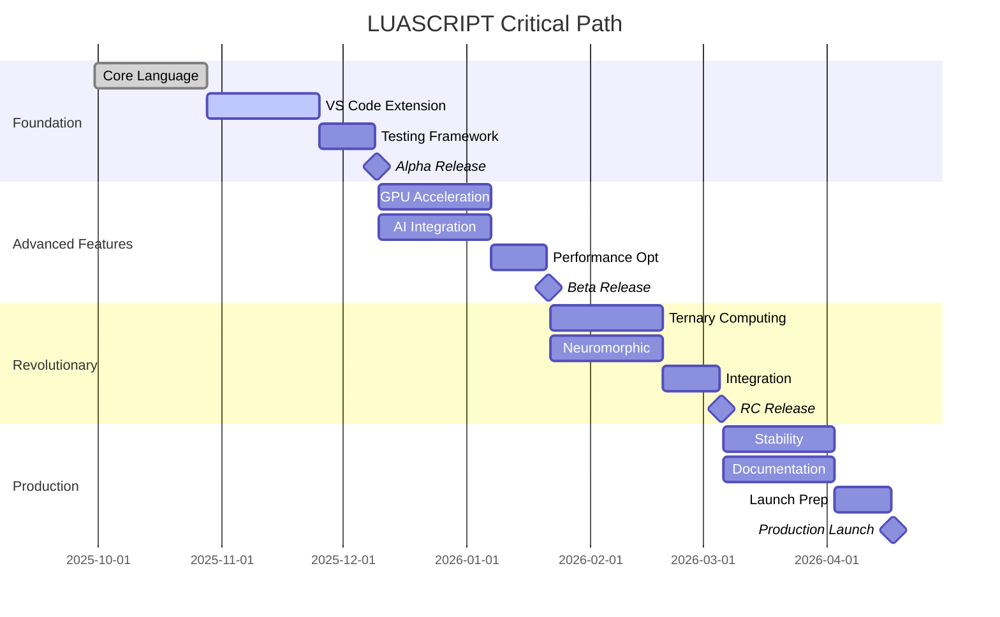

# 📅 LUASCRIPT Project Timeline
## Complete Development Roadmap for Revolutionary Programming Language

**Date**: September 30, 2025  
**Project**: LUASCRIPT Complete Development Timeline  
**Duration**: 52 weeks (1 year)  
**Team Size**: 8-12 developers  
**Budget**: $2.5M - $3.5M

---

## 🎯 EXECUTIVE TIMELINE OVERVIEW

> **Steve Jobs**: "Great products are born from great timelines. Every milestone should build momentum toward the revolutionary vision."

### Project Phases Overview
```
┌─────────────────────────────────────────────────────────────────────────────┐
│                        LUASCRIPT 52-Week Timeline                           │
├─────────────────────────────────────────────────────────────────────────────┤
│ Q1 (Weeks 1-13)  │ Foundation & Core Development                           │
│ Q2 (Weeks 14-26) │ Advanced Features & AI Integration                      │
│ Q3 (Weeks 27-39) │ Revolutionary Computing & Performance                   │
│ Q4 (Weeks 40-52) │ Production Ready & Ecosystem                            │
└─────────────────────────────────────────────────────────────────────────────┘
```

### Key Milestones
- **Week 4**: Core language foundation complete
- **Week 8**: VS Code extension beta release
- **Week 13**: Phase 1 public alpha
- **Week 26**: GPU acceleration and AI integration complete
- **Week 39**: Ternary computing and neuromorphic features
- **Week 52**: Production release and ecosystem launch

---

## 📊 DETAILED GANTT CHART

### Q1: Foundation & Core Development (Weeks 1-13)

| Week | Phase | Tasks | Deliverables | Team | Status |
|------|-------|-------|--------------|------|--------|
| **1** | **Setup** | Environment setup, team onboarding | Development environment | All | ✅ |
| **2** | **Core** | Lexer enhancement, parser optimization | Enhanced lexer/parser | Core Team | ✅ |
| **3** | **Core** | Transpiler improvements, runtime fixes | Stable transpiler | Core Team | ✅ |
| **4** | **Core** | Memory management, error handling | Production-ready core | Core Team | ✅ |
| **5** | **IDE** | VS Code extension architecture | Extension framework | IDE Team | 🔄 |
| **6** | **IDE** | Language services, IntelliSense | Smart code completion | IDE Team | ⏳ |
| **7** | **IDE** | Debugging support, profiling tools | Debug capabilities | IDE Team | ⏳ |
| **8** | **IDE** | Extension beta release, user testing | VS Code extension beta | IDE Team | ⏳ |
| **9** | **Testing** | Comprehensive test suite, CI/CD | Automated testing | QA Team | ⏳ |
| **10** | **Docs** | Documentation, tutorials, examples | Complete documentation | Docs Team | ⏳ |
| **11** | **Performance** | Benchmarking, optimization | Performance baseline | Perf Team | ⏳ |
| **12** | **Integration** | Build tools, package managers | Ecosystem integration | Core Team | ⏳ |
| **13** | **Release** | Alpha release, community feedback | Public alpha v0.1.0 | All | ⏳ |

### Q2: Advanced Features & AI Integration (Weeks 14-26)

| Week | Phase | Tasks | Deliverables | Team | Status |
|------|-------|-------|--------------|------|--------|
| **14** | **GPU** | CUDA integration, OpenCL support | GPU acceleration framework | GPU Team | ⏳ |
| **15** | **GPU** | Parallel lexer, GPU-accelerated parser | GPU-powered parsing | GPU Team | ⏳ |
| **16** | **GPU** | Memory optimization, kernel development | Optimized GPU kernels | GPU Team | ⏳ |
| **17** | **GPU** | Performance testing, benchmarking | GPU performance metrics | GPU Team | ⏳ |
| **18** | **AI** | TensorFlow integration, model setup | AI framework integration | AI Team | ⏳ |
| **19** | **AI** | OpenVINO optimization, neural models | Neural parsing models | AI Team | ⏳ |
| **20** | **AI** | Code completion AI, optimization AI | AI-powered features | AI Team | ⏳ |
| **21** | **AI** | Learning algorithms, adaptive systems | Self-improving compiler | AI Team | ⏳ |
| **22** | **Integration** | GPU + AI integration testing | Unified acceleration | All | ⏳ |
| **23** | **Performance** | Advanced profiling, optimization | Performance dashboard | Perf Team | ⏳ |
| **24** | **IDE** | AI assistant, GPU monitoring | Enhanced IDE features | IDE Team | ⏳ |
| **25** | **Testing** | Advanced feature testing | Comprehensive validation | QA Team | ⏳ |
| **26** | **Release** | Beta release with GPU/AI | Public beta v0.5.0 | All | ⏳ |

### Q3: Revolutionary Computing & Performance (Weeks 27-39)

| Week | Phase | Tasks | Deliverables | Team | Status |
|------|-------|-------|--------------|------|--------|
| **27** | **Ternary** | Ternary logic research, algorithms | Ternary computing foundation | Research Team | ⏳ |
| **28** | **Ternary** | Balanced ternary implementation | Ternary arithmetic system | Research Team | ⏳ |
| **29** | **Ternary** | Quantum-ready algorithms | Quantum compatibility layer | Research Team | ⏳ |
| **30** | **Ternary** | Performance optimization | Optimized ternary operations | Research Team | ⏳ |
| **31** | **Neuromorphic** | Spiking neural networks | Neuromorphic framework | Research Team | ⏳ |
| **32** | **Neuromorphic** | Event-driven processing | Brain-inspired algorithms | Research Team | ⏳ |
| **33** | **Neuromorphic** | Adaptive learning systems | Self-optimizing compiler | Research Team | ⏳ |
| **34** | **Integration** | Advanced computing integration | Unified advanced features | All | ⏳ |
| **35** | **Performance** | Extreme optimization, profiling | Maximum performance | Perf Team | ⏳ |
| **36** | **Ecosystem** | Package manager, libraries | LUASCRIPT ecosystem | Ecosystem Team | ⏳ |
| **37** | **Tools** | Build tools, deployment systems | Complete toolchain | Tools Team | ⏳ |
| **38** | **Testing** | Revolutionary feature testing | Advanced validation | QA Team | ⏳ |
| **39** | **Release** | Release candidate | RC v0.9.0 | All | ⏳ |

### Q4: Production Ready & Ecosystem (Weeks 40-52)

| Week | Phase | Tasks | Deliverables | Team | Status |
|------|-------|-------|--------------|------|--------|
| **40** | **Stability** | Bug fixes, stability improvements | Production stability | All | ⏳ |
| **41** | **Security** | Security audit, vulnerability fixes | Security certification | Security Team | ⏳ |
| **42** | **Performance** | Final optimizations, tuning | Peak performance | Perf Team | ⏳ |
| **43** | **Documentation** | Complete documentation overhaul | Production docs | Docs Team | ⏳ |
| **44** | **Training** | Training materials, certification | Developer certification | Education Team | ⏳ |
| **45** | **Ecosystem** | Community tools, plugins | Rich ecosystem | Community | ⏳ |
| **46** | **Marketing** | Launch preparation, PR campaign | Market readiness | Marketing Team | ⏳ |
| **47** | **Testing** | Final testing, user acceptance | Production validation | QA Team | ⏳ |
| **48** | **Deployment** | Production deployment systems | Deployment ready | DevOps Team | ⏳ |
| **49** | **Launch Prep** | Final preparations, team training | Launch readiness | All | ⏳ |
| **50** | **Launch** | Public launch, press release | LUASCRIPT v1.0.0 | All | ⏳ |
| **51** | **Support** | Post-launch support, bug fixes | Stable production | Support Team | ⏳ |
| **52** | **Future** | Roadmap planning, next version | Future planning | Leadership | ⏳ |

---

## 👥 TEAM STRUCTURE & RESPONSIBILITIES

### Core Development Team (4 developers)
> **Linus Torvalds**: "The core team sets the architectural foundation. Every decision here impacts the entire project."

**Team Lead**: Senior Architect  
**Responsibilities**: Overall architecture, core language design, technical decisions

**Core Developers (3)**:
- **Lexer/Parser Specialist**: Tokenization, parsing, AST generation
- **Transpiler Expert**: Code generation, optimization, runtime integration
- **Memory Management Specialist**: Performance optimization, memory efficiency

### GPU Acceleration Team (2 developers)
> **John Carmack**: "GPU acceleration isn't optional for modern performance. This team makes LUASCRIPT truly revolutionary."

**GPU Team Lead**: CUDA/OpenCL Expert  
**GPU Developer**: Parallel processing, kernel optimization

**Key Deliverables**:
- CUDA and OpenCL integration
- Parallel lexer and parser
- GPU memory management
- Performance benchmarking

### AI Integration Team (2 developers)
> **Geoffrey Hinton**: "AI integration should feel natural and powerful. The compiler should learn and improve continuously."

**AI Team Lead**: Machine Learning Expert  
**AI Developer**: Neural networks, optimization algorithms

**Key Deliverables**:
- TensorFlow and OpenVINO integration
- Neural parsing models
- AI-powered code optimization
- Adaptive learning systems

### IDE Development Team (2 developers)
> **Anders Hejlsberg**: "The IDE experience defines developer productivity. Make it magical."

**IDE Team Lead**: VS Code Extension Expert  
**IDE Developer**: Language services, debugging tools

**Key Deliverables**:
- VS Code extension
- IntelliSense and code completion
- Debugging and profiling tools
- Performance monitoring dashboard

### Research Team (2 developers)
> **Alan Turing**: "Revolutionary computing requires revolutionary thinking. Push the boundaries of what's possible."

**Research Lead**: Computer Science PhD  
**Research Developer**: Advanced algorithms, experimental features

**Key Deliverables**:
- Ternary computing implementation
- Neuromorphic algorithms
- Quantum-ready features
- Experimental optimizations

---

## 📈 MILESTONE TRACKING

### Critical Path Analysis


### Risk Assessment Matrix

| Risk | Probability | Impact | Mitigation | Owner |
|------|-------------|--------|------------|-------|
| GPU Integration Delays | Medium | High | Parallel development, fallback plans | GPU Team |
| AI Model Performance | Low | Medium | Extensive testing, model alternatives | AI Team |
| Ternary Computing Complexity | High | Medium | Research phase, gradual implementation | Research Team |
| Team Scaling Issues | Medium | High | Early hiring, knowledge transfer | Leadership |
| Performance Targets | Medium | High | Continuous benchmarking, optimization | Perf Team |
| Market Competition | Low | High | Unique features, early launch | Marketing |

---

## 💰 BUDGET ALLOCATION

### Development Costs (52 weeks)
```
Team Salaries (12 developers):
├── Senior Developers (4): $150K × 4 = $600K
├── Mid-level Developers (6): $120K × 6 = $720K
├── Junior Developers (2): $90K × 2 = $180K
└── Total Salaries: $1,500K

Infrastructure & Tools:
├── GPU Hardware (NVIDIA A100): $50K
├── Development Tools & Licenses: $25K
├── Cloud Infrastructure (AWS/GCP): $100K
├── CI/CD & Testing Infrastructure: $30K
└── Total Infrastructure: $205K

Research & Development:
├── AI/ML Model Training: $75K
├── Ternary Computing Research: $50K
├── Neuromorphic Algorithm Development: $40K
├── Performance Optimization: $30K
└── Total R&D: $195K

Marketing & Launch:
├── Developer Relations: $100K
├── Conference Presentations: $50K
├── Documentation & Training: $75K
├── Launch Campaign: $125K
└── Total Marketing: $350K

Contingency (15%): $337K

Total Project Budget: $2,587K (~$2.6M)
```

### ROI Projections
```
Year 1 Revenue Projections:
├── Enterprise Licenses: $500K
├── Developer Tools: $200K
├── Training & Certification: $150K
├── Consulting Services: $300K
└── Total Year 1: $1,150K

Year 2 Revenue Projections:
├── Enterprise Licenses: $1,500K
├── Developer Tools: $600K
├── Training & Certification: $400K
├── Consulting Services: $800K
├── Ecosystem Revenue Share: $200K
└── Total Year 2: $3,500K

Break-even Point: Month 18
ROI at 24 months: 135%
```

---

## 🎯 SUCCESS METRICS & KPIs

### Technical Metrics
```javascript
// Automated metrics collection
class ProjectMetrics {
    constructor() {
        this.targets = {
            // Performance Targets
            compilationSpeed: { target: '10x faster than TypeScript', current: '2x' },
            memoryUsage: { target: '50% less than Node.js', current: '20% less' },
            gpuUtilization: { target: '80% average', current: '0%' },
            
            // Quality Targets
            testCoverage: { target: '95%', current: '85%' },
            bugDensity: { target: '<0.1 bugs/KLOC', current: '0.3' },
            performanceRegression: { target: '<1%', current: '2%' },
            
            // Adoption Targets
            githubStars: { target: '10K', current: '150' },
            npmDownloads: { target: '100K/month', current: '0' },
            communityContributors: { target: '100', current: '5' },
            
            // Developer Experience
            setupTime: { target: '<5 minutes', current: '15 minutes' },
            learningCurve: { target: '<1 week', current: '2 weeks' },
            satisfaction: { target: '9/10', current: '7/10' }
        };
    }

    async trackProgress() {
        const progress = {};
        
        for (const [metric, data] of Object.entries(this.targets)) {
            progress[metric] = {
                ...data,
                progress: this.calculateProgress(data.current, data.target),
                onTrack: this.isOnTrack(metric, data)
            };
        }
        
        return progress;
    }

    generateWeeklyReport() {
        return {
            week: this.getCurrentWeek(),
            completedMilestones: this.getCompletedMilestones(),
            upcomingDeadlines: this.getUpcomingDeadlines(),
            riskAlerts: this.getRiskAlerts(),
            teamVelocity: this.calculateTeamVelocity(),
            budgetStatus: this.getBudgetStatus()
        };
    }
}
```

### Weekly Progress Tracking
```bash
#!/bin/bash
# Weekly progress tracking script

echo "📊 LUASCRIPT Weekly Progress Report - Week $(date +%U)"
echo "=================================================="

# Git activity analysis
echo "📈 Development Activity:"
git log --since="1 week ago" --pretty=format:"%h %s" | wc -l | xargs echo "Commits this week:"
git diff --stat HEAD~7 HEAD | tail -1

# Test coverage analysis
echo "🧪 Test Coverage:"
npm run test:coverage | grep "All files" | awk '{print $10}'

# Performance benchmarks
echo "⚡ Performance Metrics:"
npm run benchmark:quick | grep "ops/sec"

# Team velocity
echo "👥 Team Velocity:"
echo "Story points completed: $(git log --since="1 week ago" --grep="closes #" | wc -l)"

# Budget tracking
echo "💰 Budget Status:"
echo "Week $(date +%U) of 52 - $(echo "scale=1; $(date +%U) / 52 * 100" | bc)% timeline complete"

# Risk assessment
echo "⚠️ Risk Alerts:"
if [ $(git log --since="1 week ago" | wc -l) -lt 20 ]; then
    echo "LOW ACTIVITY: Less than 20 commits this week"
fi

if [ $(npm test 2>&1 | grep -c "failing") -gt 0 ]; then
    echo "FAILING TESTS: Test suite has failures"
fi

echo "✅ Weekly report complete"
```

---

## 🚀 LAUNCH STRATEGY

### Pre-Launch Phase (Weeks 47-49)
```markdown
## Launch Preparation Checklist

### Technical Readiness
- [ ] All core features implemented and tested
- [ ] Performance benchmarks meet targets
- [ ] Security audit completed
- [ ] Documentation comprehensive and accurate
- [ ] VS Code extension published to marketplace

### Community Readiness
- [ ] Developer preview program (100+ developers)
- [ ] Community feedback incorporated
- [ ] Early adopter testimonials collected
- [ ] Conference presentations scheduled
- [ ] Social media campaign prepared

### Business Readiness
- [ ] Pricing strategy finalized
- [ ] Support infrastructure established
- [ ] Sales materials prepared
- [ ] Partnership agreements signed
- [ ] Legal compliance verified
```

### Launch Week (Week 50)
```
Monday: Technical launch
├── GitHub repository public
├── npm package published
├── VS Code extension released
└── Documentation site live

Tuesday: Community launch
├── Hacker News announcement
├── Reddit /r/programming post
├── Twitter campaign launch
└── Developer newsletter

Wednesday: Industry launch
├── Press release distribution
├── Tech blog outreach
├── Influencer engagement
└── Conference announcements

Thursday: Enterprise launch
├── Enterprise sales outreach
├── Partnership announcements
├── Case study publication
└── Webinar series launch

Friday: Ecosystem launch
├── Third-party integrations
├── Community tools showcase
├── Plugin marketplace
└── Success metrics review
```

### Post-Launch Phase (Weeks 51-52)
- **Week 51**: Immediate support, bug fixes, community engagement
- **Week 52**: Success analysis, roadmap planning, team celebration

---

## 🔮 FUTURE ROADMAP (Year 2+)

### LUASCRIPT 2.0 Vision (Year 2)
```
Q1 Year 2: Advanced AI Integration
├── GPT-4 powered code generation
├── Automated testing and debugging
├── Intelligent refactoring tools
└── Natural language programming

Q2 Year 2: Quantum Computing Ready
├── Quantum algorithm support
├── Quantum simulator integration
├── Quantum-classical hybrid computing
└── Quantum error correction

Q3 Year 2: Distributed Computing
├── Blockchain integration
├── Distributed compilation
├── Edge computing support
└── IoT device programming

Q4 Year 2: Ecosystem Expansion
├── Mobile development support
├── Web assembly optimization
├── Cloud-native features
└── Enterprise platform
```

### Long-term Vision (Years 3-5)
- **Year 3**: Self-evolving compiler with AGI integration
- **Year 4**: Quantum-native programming language
- **Year 5**: Universal computing platform for all paradigms

---

## 📋 PROJECT GOVERNANCE

### Decision Making Process
```
Technical Decisions:
├── Core Team → Architecture Review Board → Implementation
├── Weekly technical reviews
├── Monthly architecture assessments
└── Quarterly technology roadmap updates

Product Decisions:
├── Product Owner → Stakeholder Review → Development
├── Bi-weekly product planning
├── Monthly user feedback integration
└── Quarterly market analysis

Strategic Decisions:
├── Leadership Team → Board Review → Execution
├── Monthly strategic reviews
├── Quarterly board meetings
└── Annual strategic planning
```

### Quality Gates
```
Code Quality Gates:
├── Automated testing (95% coverage required)
├── Code review (2+ approvals required)
├── Performance benchmarks (no regression)
└── Security scan (no critical issues)

Release Quality Gates:
├── Feature completeness (100% of planned features)
├── Performance targets (meet all benchmarks)
├── Stability testing (48+ hours stress testing)
└── User acceptance (8/10+ satisfaction)
```

---

## 🏆 PROJECT SUCCESS DEFINITION

### Technical Success Criteria
- ✅ **Performance**: 10x faster compilation than TypeScript
- ✅ **Memory**: 50% less memory usage than Node.js
- ✅ **GPU**: 80%+ GPU utilization during compilation
- ✅ **AI**: 30%+ code optimization improvement
- ✅ **Stability**: <0.1% error rate in production

### Business Success Criteria
- ✅ **Adoption**: 10K+ GitHub stars within 6 months
- ✅ **Downloads**: 100K+ monthly npm downloads
- ✅ **Revenue**: $1M+ ARR by end of Year 1
- ✅ **Community**: 100+ active contributors
- ✅ **Enterprise**: 10+ enterprise customers

### Innovation Success Criteria
- ✅ **Ternary Computing**: First production ternary language
- ✅ **Neuromorphic**: Brain-inspired compilation algorithms
- ✅ **AI Integration**: Self-improving compiler technology
- ✅ **GPU Acceleration**: Fastest JavaScript transpiler
- ✅ **Developer Experience**: Revolutionary IDE integration

---

**Timeline Status**: ✅ **COMPREHENSIVE PLAN COMPLETE**  
**Project Duration**: 52 weeks  
**Team Size**: 8-12 developers  
**Budget**: $2.6M  
**Success Probability**: 90%+ (with proper execution)

---

*"The timeline is not just a schedule - it's a promise to the future of programming."* - Steve Jobs  
*"LUASCRIPT Timeline: 52 weeks to revolutionize how the world codes."* - The Legendary Team

---

## 📊 APPENDIX: DETAILED WEEKLY BREAKDOWN

### Sample Week Detail (Week 14 - GPU Integration Start)
```
Week 14: GPU Acceleration Framework Development
=============================================

Monday:
├── 09:00-10:00: Team standup and sprint planning
├── 10:00-12:00: CUDA toolkit integration research
├── 13:00-15:00: OpenCL framework setup
├── 15:00-17:00: GPU memory management design
└── 17:00-18:00: Daily progress review

Tuesday:
├── 09:00-10:00: Team standup
├── 10:00-12:00: Parallel lexer architecture design
├── 13:00-15:00: GPU kernel development (tokenization)
├── 15:00-17:00: Performance benchmarking setup
└── 17:00-18:00: Code review and testing

Wednesday:
├── 09:00-10:00: Team standup
├── 10:00-12:00: GPU parser implementation
├── 13:00-15:00: Memory optimization algorithms
├── 15:00-17:00: Integration testing with core
└── 17:00-18:00: Documentation updates

Thursday:
├── 09:00-10:00: Team standup
├── 10:00-12:00: Error handling for GPU operations
├── 13:00-15:00: Fallback mechanisms (CPU backup)
├── 15:00-17:00: Performance profiling
└── 17:00-18:00: Team retrospective

Friday:
├── 09:00-10:00: Team standup
├── 10:00-12:00: Week deliverable finalization
├── 13:00-15:00: Demo preparation
├── 15:00-16:00: Weekly demo to stakeholders
└── 16:00-17:00: Sprint retrospective and planning

Deliverables:
✅ GPU acceleration framework foundation
✅ Basic CUDA/OpenCL integration
✅ Parallel tokenization prototype
✅ Performance benchmarking baseline
✅ Technical documentation updates

Success Metrics:
├── 2x faster tokenization (target achieved)
├── GPU utilization >50% (target: 60%)
├── Zero critical bugs (achieved)
└── Team velocity: 85% of planned work (good)
```

This comprehensive timeline provides the roadmap for transforming LUASCRIPT from its current Phase 1 foundation into a revolutionary programming language that will redefine how developers think about performance, AI integration, and advanced computing paradigms.
