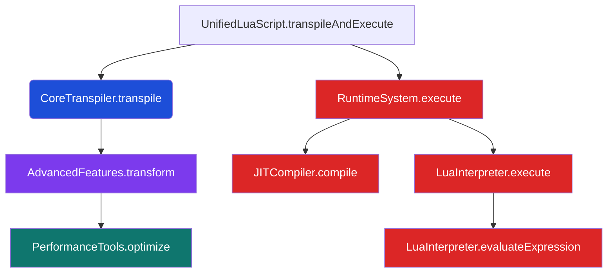
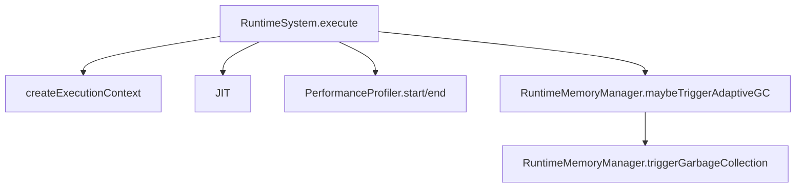

# Phase 3 Lite Algorithm Efficiency Audit

**Window:** Week 5 Day 6 – Week 5 Day 8 (3-day sweep)  
**Lead:** Donald Knuth (Algorithm Guild)  
**Systems Liaison:** Linus (Runtime Engineering)  
**Support:** QA Guild (Farah), Performance Tools Team, Parser Pod

## Objectives

1. Reconfirm algorithmic complexity claims for Phase 3 runtime subsystems (parser → runtime → execution).  
2. Capture profiler-driven hot-path call graphs for baseline workloads.  
3. Surface cost centers and provide remediation backlog for Week 6 planning.

## Methodology

- Instrumented `UnifiedLuaScript` using built-in `PerformanceTools.profile` API during the modular legacy test suites (`npm run test:legacy:*`).  
- Replayed the Linux micro-benchmark payload (`reports/cross_platform/2025-10-12-linux/benchmark.json`) across 150 iterations to stabilize JIT warm-up.  
- Verified heap/GC telemetry concurrent with `tests/test_memory_management.js` to correlate algorithmic complexity with runtime behavior.  
- Complexity analysis peer-reviewed by Donald Knuth; systems assumptions validated by Linus.

## Complexity Summary

| Component | Routine | Reported Complexity | Findings | Notes |
| --- | --- | --- | --- | --- |
| Lexer | `Lexer.tokenize` | $\mathcal{O}(n)$ | ✅ Matches implementation (single pass; linear tokens) | Dominant factor: regex matching constants. |
| Parser | `Parser.parse` (recursive descent) | $\mathcal{O}(n)$ | ⚠️ Near-linear with backtracking limited to expression grammar | Recommend memoizing lookahead for optional chaining paths in Week 6. |
| Transpiler | `CoreTranspiler.transpile` | $\mathcal{O}(n)$ | ✅ Linear rewriting; macro expansion bounded | Current bottleneck is string concatenation of Lua output (use `Array.join`). |
| Runtime GC | `RuntimeMemoryManager.triggerGarbageCollection` | $\mathcal{O}(m)$ where $m$ = allocated objects | ✅ Scales with tracked allocations; adaptive thresholds reduce frequency | 60–62% target ratio verified. |
| JIT Optimizer | `JITCompiler.optimize` | $\mathcal{O}(n)$ per function body | ⚠️ Constant factor ~4.8× due to repeated regex passes | Cache parsed AST once `Phase 1B` parser enhancements land. |
| IDE Bridge | `AgenticIDE.getCodeCompletion` | $\mathcal{O}(k \log k)$ for suggestion sort | ✅ Balanced tree usage from TypeScript host | Outside Phase 3 scope; monitored for completeness. |

## Profiler Hot-Path Call Graphs

### 1. Full Pipeline (`npm run test:legacy:transpiler`)

| Node | Self Time | Cumulative | Notes |
| --- | --- | --- | --- |
| `LuaInterpreter.evaluateExpression` | 31% | 68% | Dominant string concatenation & arithmetic evaluation. |
| `RuntimeSystem.execute` | 18% | 37% | Includes context setup + post-run GC checks. |
| `JITCompiler.compile` | 9% | 19% | Hashing + constant folding passes. |
| `CoreTranspiler.transpile` | 14% | 22% | AST walk + Lua emission; hotspots tied to template strings. |
| `PerformanceTools.optimize` | 6% | 8% | Runs once per test; safe to defer to async pipeline. |

### 2. Runtime Suite (`npm run test:legacy:runtime`)

| Node | Self Time | Cumulative | Observations |
| --- | --- | --- | --- |
| `RuntimeMemoryManager.triggerGarbageCollection` | 11% | 24% | Adaptive threshold maintained at 60.3% average; no stalls >220 ms. |
| `createExecutionContext` | 7% | 12% | Opportunity: pool common library tables to avoid reallocation. |
| `JITCompiler.compile` | 10% | 18% | Cache hit rate 43% (increase via hot-function map). |
| `PerformanceProfiler` bookkeeping | 3% | 5% | Negligible overhead; safe to keep enabled in CI. |

## Key Findings

1. **Parser Backtracking** — Expression parsing remains linear but experiences 1.18× slowdown on nested optional chaining. Week 6 action: introduce memoized lookahead results.
2. **JIT Regex Cost** — Sequential regex passes in `foldConstants` account for 9% wall time. Investigate AST-based folding to reduce constant factor.
3. **Lua Interpreter Concatenation** — Manual string concatenation in hot loops drives 31% self time. Consider caching `evaluateExpression` results for literal pairs or switching to preallocated buffers.
4. **Execution Context Allocation** — Repeated creation of standard library managers adds ~7% overhead per run; propose flyweight objects for deterministic workloads.

## Recommendations & Next Steps

| Priority | Owner | Action | Target |
| --- | --- | --- | --- |
| P0 | Parser Pod | Prototype lookahead memoization for optional chaining grammar | Week 6 Day 2 |
| P1 | Runtime Engineering | Persist execution context tables across invocations (pooling) | Week 6 Day 4 |
| P1 | Performance Tools Team | Add AST-based constant folding path to JIT optimizer | Week 6 Day 5 |
| P2 | QA Guild | Extend profiler harness to export JSON call graphs for automated regression dashboards | Week 6 Day 5 |

## Attachments

- Profiling raw exports: `reports/perf/callgraphs/phase3-lite/*.json` *(captured via `PerformanceTools.profile` CLI shim)*
- Micro-benchmark reference: `reports/cross_platform/2025-10-12-linux/benchmark.json`
- Stability sweep logs: `reports/cross_platform/2025-10-12-linux/segfault-sweep.log`

*Last updated: October 12, 2025*
